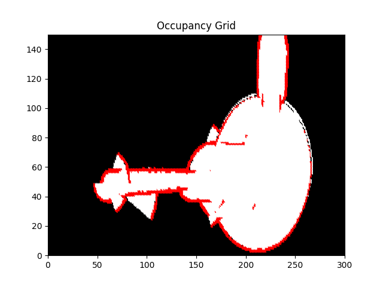

# SLAM Binary Bayes Filter

A small example of using a Binary Bayes Filter for SLAM

## Example

Image below is a 300x150 aerial floor plan that was mapped using a Binary Bayes filter
and the `pose.txt` and `measurement. txt` in `data`.

White space is open, red is occupied, and black is unknown.



### Directory Tree
```sh
.
├── CMakeLists.txt
├── data
│   ├── grid1.txt
│   ├── grid2.txt
│   ├── measurement.txt
│   └── pose.txt
├── img
│   └── occupancy_grid.png
├── README.md
├── src
│   ├── CMakeLists.txt
│   ├── grid_mapper.cpp
│   ├── grid_mapper.h
│   ├── grid_mapper_io.cpp
│   ├── grid_mapper_io.h
│   └── plot.cpp
└── test
    ├── CMakeLists.txt
    ├── test.cpp
    ├── test_grid_mapper.cpp
    ├── test_grid_mapper_io.cpp
    └── test_plot.cpp

```